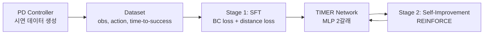

# Architecture: Self-Improving EMFs Gym

이 문서는 본 프로젝트의 구조와 설계 의도를 담고 있습니다.

## 1. 프로젝트 개요

Ghasemipour et al. 2025, *Self-Improving Embodied Foundation Models*(이하 SI-EFM)의 공식 pointmass 데모를 재현하고, 그 위에 환경 기능을 확장해 방법론의 경향을 분석하는 프로젝트입니다.

- **1차 목표 — 클린 버전**: `references/self-improving-efms.github.io/`에서 홈페이지 관련 파일(html, css, js, 웹 assets)을 제거한 클린 버전을 구성한다. **원본 코드는 그대로 복사**하고 웹 파일만 삭제하는 방식을 따른다 (ADR-004).
- **2차 목표 — 환경 확장 실험**: pointmass gym 환경에 아래 기능을 추가해 정책·steps-to-go 예측의 경향을 관찰한다. 상세 요구사항은 추후 별도 md로 제공된다.
  1. 순간 변위(순간이동) 발생 기능
  2. 바이어스(외력) 인가 기능
  3. 직접 조종하며 steps-to-go 그래프를 관찰하는 기능

## 2. 방법론 요약 (SI-EFM pointmass)

원본 노트북(`pointmass_notebook.ipynb`)의 파이프라인:



- **환경**: `Point2D` (dm_env) — 2D 포인트매스가 랜덤 목표점으로 이동. 관측 `{cur_pos, cur_vel, goal_pos}`, 액션은 2D 가속도, 성공 반경 0.15.
- **네트워크 (TIMER)**: MLP 2갈래 헤드
  - 액션 헤드: 연속 액션 분포 (MVN diag)
  - 거리 헤드: **성공까지 남은 스텝 수(steps-to-go)** 를 discrete bin categorical로 예측
- **Stage 1 (SFT)**: PD 컨트롤러 시연 데이터에 대해 BC loss + steps-to-go 예측 loss 지도학습.
- **Stage 2 (Self-Improvement)**: 정책 롤아웃 후 **자체 steps-to-go 예측값의 감소분** `r_t = -(d_{t+1} - d_t)` 을 reward로 삼아 REINFORCE 업데이트. 외부 reward 불필요 — 논문의 핵심.

## 3. 디렉토리 구조 및 Git 추적 정책

**git은 gym 환경 코드 + 하네스 정책 문서(`CLAUDE.md`, `docs/ARCHITECTURE.md`, `docs/ADR.md`)를 추적한다.** 이 레포는 public이므로, PC/GPU 구성처럼 로컬 인프라에 관한 내용은 `docs/private/`에 두고 `.gitignore`로 제외한다. `scripts/`(하네스 실행기 자체)와 `.claude/skills/`(스킬 정의)도 예외적으로 추적한다 — 나머지 하네스 파일(`.claude/` 하위 그 외, `experiments/`, `phases/`, `references/`)은 여전히 로컬 전용이다. 작업 코드는 harness 파일이 없다고 생각하고 **레포 루트**에 배치한다.

```
requirements.txt (또는 environment.yml)  # 실행 환경 정의
.gitignore                       # (추적됨)
CLAUDE.md                        # (추적됨) 작업 규칙
docs/                            # (추적됨) 본 문서, ADR, docs/superpowers/(브레인스토밍 스펙·플랜)
  private/                       #   (미추적, 로컬 전용) ENVIRONMENT.md 등 인프라 정보
scripts/                         # (추적됨) 하네스 실행기 (execute.py, merge_to_main.py 등)
.claude/skills/                  # (추적됨) 스킬 정의 (harness/SKILL.md 등)
--- 이하 git 미추적 (로컬 전용 harness) ---
references/                      # 원본 참조 (읽기 전용, 수정 금지)
  self-improving-efms.github.io/ #   공식 웹사이트 레포 (노트북 + 웹 파일)
  Ghasemipour 등 - 2025 - ....pdf
experiments/                     # 실험 기록
phases/                          # (레거시) 과거 phase의 step 정의·실행 기록 —
                                  #   새 작업은 docs/superpowers/plans/*.md +
                                  #   <plan>.state.json을 쓴다 (harness 스킬 참고)
projects/                        # 연구 프로젝트 폴더 모음
  pointmass/                     #   1차 목표 산출물: 클린 버전 (원본 그대로 복사) —
                                  #     pointmass_core.py, pointmass_notebook.ipynb.
                                  #     archive/에 과거 진단·실험 스크립트(전부 pointmass_core
                                  #     파생) 보관. 구조는 projects/pointmass/README.md 참고.
  grasp_carry/                   #   은닉 물성 기반 파지·운반 서브프로젝트 (ADR-006) —
                                  #     JAX/Haiku 스택(ADR-003과 공유). src/grasp_carry/
                                  #     구조는 projects/grasp_carry/README.md 참고.
  square_assembly/               #   robomimic/Diffusion Policy 서브프로젝트 (ADR-007) —
                                  #     별도 스택(PyTorch), 별도 conda env. src/square_assembly/
                                  #     구조·환경설정은 projects/square_assembly/README.md 참고.
```

> ⚠️ 위 트리는 conflict 해소 시점 기준으로, `docker/` 등 최근 추가된 최상위 디렉토리는 아직 반영하지 않았다(`archive/`는 정리 완료 — `projects/pointmass/archive/`, `projects/grasp_carry/archive/`로 흡수됨. 루트 `configs/`는 죽은 phase-2 설정 스냅샷이라 삭제됨).

- 클린 버전은 레포 루트에 원본 파일명·내용 그대로 복사한다 (ADR-004).
- 2차 목표의 확장 코드도 루트에 추가한다 (원본 노트북은 수정하지 않고 별도 파일로 — 4절 참조).
- 대용량 데이터셋·체크포인트는 git 추적 제외 대상이다(ADR-002). 로컬에 실물을 두는 대신 심볼릭 링크(`ln -s`)로 외부 경로(별도 스토리지 볼륨 등)와 연결하는 것을 권장한다.

## 4. 확장 원칙 (2차 목표)

- **원본 비침습**: 복사된 원본 코드(노트북/모듈)는 수정하지 않는다. 확장 기능은 서브클래스·래퍼·별도 스크립트로 추가한다. 이유: 원본과의 수치 재현성 기준선을 항상 유지하기 위함.
- 예: 순간이동/외력 기능은 `Point2D`를 상속한 확장 환경 클래스로, 수동 조종 관찰 기능은 별도 실행 스크립트로 구현한다.

## 5. 실행 환경

- 스택: JAX / Haiku / optax / dm_env / TensorFlow(tf.data, tfp) — 원본 노트북 스택을 그대로 따른다 (ADR-003).
- 가상환경은 레포 단위로 독립 구성한다 (ADR-001).
- 실제 하드웨어 구성(PC 대수, GPU 유무 등)은 `docs/private/ENVIRONMENT.md`(git 미추적, 로컬 전용) 참고.
